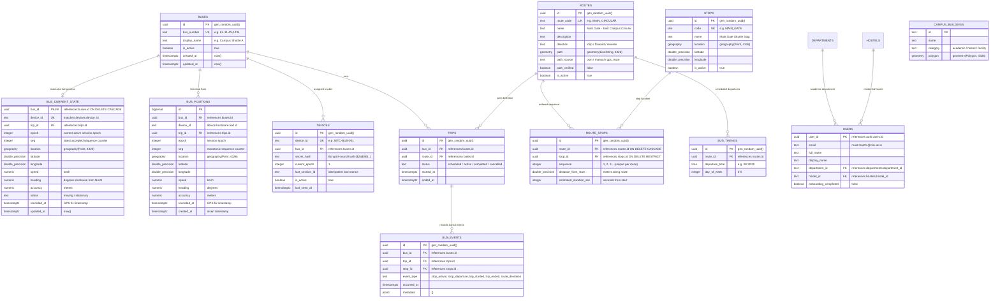

# Database Entity-Relationship Diagram

```mermaid
erDiagram
    BUSES ||--o| BUS_CURRENT_STATE : "maintains live position"
    BUSES ||--o{ BUS_POSITIONS : "historical fixes"
    BUSES ||--o{ DEVICES : "assigned tracker"
    BUSES ||--o{ TRIPS : "runs"
    TRIPS ||--o{ BUS_EVENTS : "records transit events"
    ROUTES ||--o{ TRIPS : "path definition"
    ROUTES ||--o{ ROUTE_STOPS : "ordered sequence"
    STOPS ||--o{ ROUTE_STOPS : "stop location"
    ROUTES ||--o{ BUS_TIMINGS : "scheduled departures"
    DEPARTMENTS ||--o{ USERS : "academic department"
    HOSTELS ||--o{ USERS : "residential hostel"

    BUSES {
        uuid id PK "gen_random_uuid()"
        text bus_number UK "e.g. KL-11-AV-1234"
        text display_name "e.g. Campus Shuttle A"
        boolean is_active "true"
        timestamptz created_at "now()"
        timestamptz updated_at "now()"
    }

    DEVICES {
        uuid id PK "gen_random_uuid()"
        text device_id UK "e.g. NITC-BUS-001"
        uuid bus_id FK "references buses.id"
        text secret_hash "Bcrypt 8-round hash ($2a$08$...)"
        integer current_epoch "1"
        text last_session_id "idempotent boot nonce"
        boolean is_active "true"
        timestamptz last_seen_at
    }

    ROUTES {
        uuid id PK "gen_random_uuid()"
        text route_code UK "e.g. MAIN_CIRCULAR"
        text name "Main Gate - East Campus Circular"
        text description
        text direction "loop / forward / reverse"
        geometry path "geometry(LineString, 4326)"
        text path_source "osm / manual / gps_trace"
        boolean path_verified "false"
        boolean is_active "true"
    }

    STOPS {
        uuid id PK "gen_random_uuid()"
        text code UK "e.g. MAIN_GATE"
        text name "Main Gate Shuttle Stop"
        geography location "geography(Point, 4326)"
        double_precision latitude
        double_precision longitude
        boolean is_active "true"
    }

    ROUTE_STOPS {
        uuid id PK "gen_random_uuid()"
        uuid route_id FK "references routes.id ON DELETE CASCADE"
        uuid stop_id FK "references stops.id ON DELETE RESTRICT"
        integer sequence "1, 2, 3... (unique per route)"
        double_precision distance_from_start "meters along route"
        integer estimated_duration_sec "seconds from start"
    }

    TRIPS {
        uuid id PK "gen_random_uuid()"
        uuid bus_id FK "references buses.id"
        uuid route_id FK "references routes.id"
        text status "scheduled / active / completed / cancelled"
        timestamptz started_at
        timestamptz ended_at
    }

    BUS_CURRENT_STATE {
        uuid bus_id PK,FK "references buses.id ON DELETE CASCADE"
        text device_id UK "matches devices.device_id"
        uuid trip_id FK "references trips.id"
        integer epoch "current active session epoch"
        integer seq "latest accepted sequence counter"
        geography location "geography(Point, 4326)"
        double_precision latitude
        double_precision longitude
        numeric speed "km/h"
        numeric heading "degrees clockwise from North"
        numeric accuracy "meters"
        text status "moving / stationary"
        timestamptz recorded_at "GPS fix timestamp"
        timestamptz updated_at "now()"
    }

    BUS_POSITIONS {
        bigserial id PK
        uuid bus_id FK "references buses.id"
        text device_id "device hardware text id"
        uuid trip_id FK "references trips.id"
        integer epoch "session epoch"
        integer seq "monotonic sequence counter"
        geography location "geography(Point, 4326)"
        double_precision latitude
        double_precision longitude
        numeric speed "km/h"
        numeric heading "degrees"
        numeric accuracy "meters"
        timestamptz recorded_at "GPS fix timestamp"
        timestamptz created_at "insert timestamp"
    }

    BUS_EVENTS {
        uuid id PK "gen_random_uuid()"
        uuid bus_id FK "references buses.id"
        uuid trip_id FK "references trips.id"
        uuid stop_id FK "references stops.id"
        text event_type "stop_arrival, stop_departure, trip_started, trip_ended, route_deviation"
        timestamptz occurred_at
        jsonb metadata "{}"
    }

    BUS_TIMINGS {
        uuid id PK "gen_random_uuid()"
        uuid route_id FK "references routes.id"
        time departure_time "e.g. 08:30:00"
        integer day_of_week "0-6"
    }

    CAMPUS_BUILDINGS {
        text id PK
        text name
        text category "academic / hostel / facility"
        geometry polygon "geometry(Polygon, 4326)"
    }

    USERS {
        uuid user_id PK "references auth.users.id"
        text email "must match @nitc.ac.in"
        text full_name
        text display_name
        text department_id FK "references departments.department_id"
        text hostel_id FK "references hostels.hostel_id"
        boolean onboarding_completed "false"
    }
```
