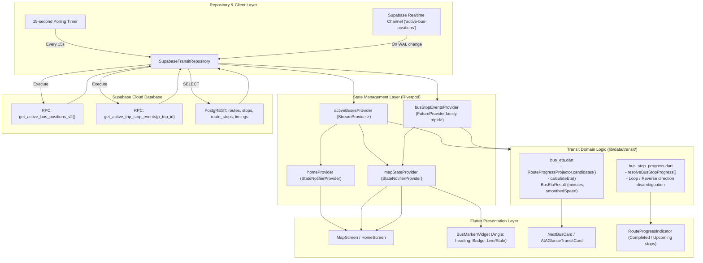

# Flutter Live Tracking Data Flow Diagram

```mermaid
flowchart TD
    subgraph UI ["Flutter Presentation Layer"]
        Screen["MapScreen / HomeScreen"]
        Marker["BusMarkerWidget (Angle: heading, Badge: Live/Stale)"]
        Card["NextBusCard / AtAGlanceTransitCard"]
        Progress["RouteProgressIndicator (Completed / Upcoming stops)"]
    end

    subgraph StateTier ["State Management Layer (Riverpod)"]
        P_Buses["activeBusesProvider (StreamProvider<List<Bus>>)"]
        P_Events["busStopEventsProvider (FutureProvider.family<List<BusStopEvent>, tripId>)"]
        P_Map["mapStateProvider (StateNotifierProvider<MapState>)"]
        P_Home["homeProvider (StateNotifierProvider<HomeState>)"]
    end

    subgraph LogicTier ["Transit Domain Logic (lib/data/transit/)"]
        ETA["bus_eta.dart<br/>- RouteProgressProjector.candidates()<br/>- calculateEta()<br/>- BusEtaResult (minutes, smoothedSpeed)"]
        StopProgress["bus_stop_progress.dart<br/>- resolveBusStopProgress()<br/>- Loop / Reverse direction disambiguation"]
    end

    subgraph RepoTier ["Repository & Client Layer"]
        Repo["SupabaseTransitRepository"]
        Timer["15-second Polling Timer"]
        Channel["Supabase Realtime Channel ('active-bus-positions')"]
    end

    subgraph RemoteTier ["Supabase Cloud Database"]
        RPC_Buses["RPC: get_active_bus_positions_v2()"]
        RPC_Events["RPC: get_active_trip_stop_events(p_trip_id)"]
        Tables_Static["PostgREST: routes, stops, route_stops, timings"]
    end

    %% Execution connections
    Timer -->|Every 15s| Repo
    Channel -->|On WAL change| Repo
    Repo -->|Execute| RPC_Buses
    Repo -->|Execute| RPC_Events
    Repo -->|SELECT| Tables_Static

    RPC_Buses --> Repo
    RPC_Events --> Repo
    Tables_Static --> Repo

    Repo --> P_Buses
    Repo --> P_Events

    P_Buses --> P_Home
    P_Buses --> P_Map
    P_Events --> P_Map

    P_Home --> Screen
    P_Map --> Screen

    P_Buses --> LogicTier
    P_Events --> LogicTier

    ETA --> Card
    StopProgress --> Progress
    P_Map --> Marker
    P_Map --> Screen
```
