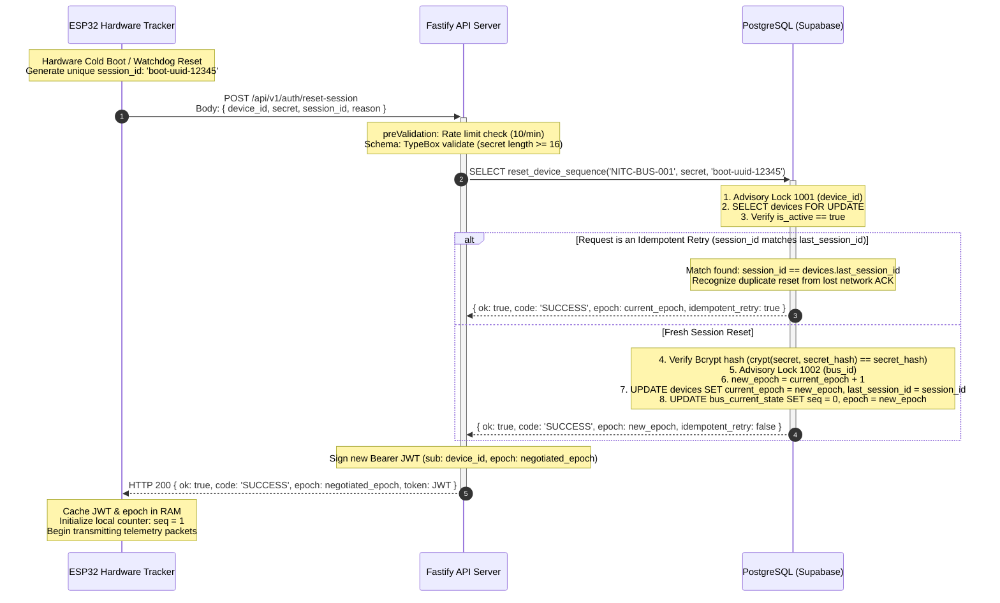

# Device Boot & Session Reset Sequence Diagram

```mermaid
sequenceDiagram
    autonumber
    participant ESP as ESP32 Hardware Tracker
    participant FST as Fastify API Server
    participant PG as PostgreSQL (Supabase)

    Note over ESP: Hardware Cold Boot / Watchdog Reset<br/>Generate unique session_id: 'boot-uuid-12345'
    ESP->>+FST: POST /api/v1/auth/reset-session<br/>Body: { device_id, secret, session_id, reason }

    Note over FST: preValidation: Rate limit check (10/min)<br/>Schema: TypeBox validate (secret length >= 16)
    FST->>+PG: SELECT reset_device_sequence('NITC-BUS-001', secret, 'boot-uuid-12345')

    Note over PG: 1. Advisory Lock 1001 (device_id)<br/>2. SELECT devices FOR UPDATE<br/>3. Verify is_active == true
    
    alt Request is an Idempotent Retry (session_id matches last_session_id)
        Note over PG: Match found: session_id == devices.last_session_id<br/>Recognize duplicate reset from lost network ACK
        PG-->>FST: { ok: true, code: 'SUCCESS', epoch: current_epoch, idempotent_retry: true }
    else Fresh Session Reset
        Note over PG: 4. Verify Bcrypt hash (crypt(secret, secret_hash) == secret_hash)<br/>5. Advisory Lock 1002 (bus_id)<br/>6. new_epoch = current_epoch + 1<br/>7. UPDATE devices SET current_epoch = new_epoch, last_session_id = session_id<br/>8. UPDATE bus_current_state SET seq = 0, epoch = new_epoch
        PG-->>-FST: { ok: true, code: 'SUCCESS', epoch: new_epoch, idempotent_retry: false }
    end

    Note over FST: Sign new Bearer JWT (sub: device_id, epoch: negotiated_epoch)
    FST-->>-ESP: HTTP 200 { ok: true, code: 'SUCCESS', epoch: negotiated_epoch, token: JWT }

    Note over ESP: Cache JWT & epoch in RAM<br/>Initialize local counter: seq = 1<br/>Begin transmitting telemetry packets
```
