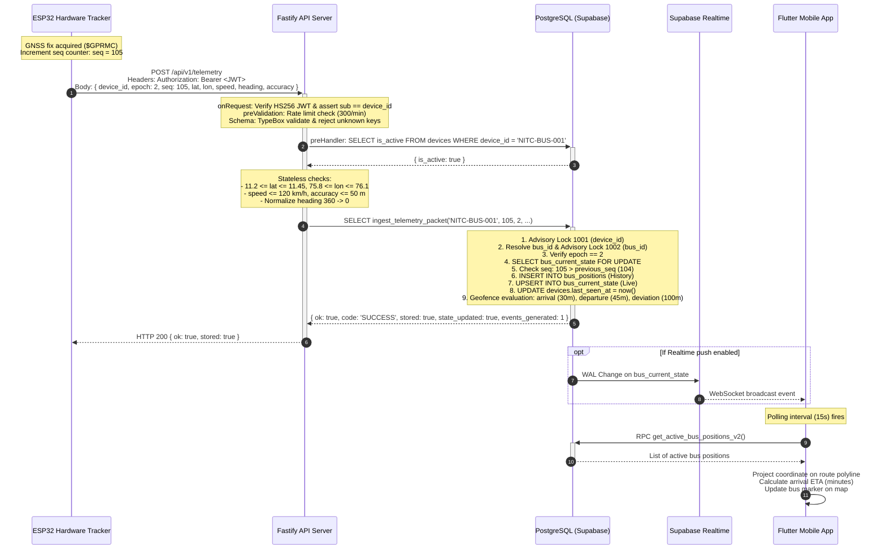

# Telemetry Ingestion Sequence Diagram

```mermaid
sequenceDiagram
    autonumber
    participant ESP as ESP32 Hardware Tracker
    participant FST as Fastify API Server
    participant PG as PostgreSQL (Supabase)
    participant RT as Supabase Realtime
    participant FLT as Flutter Mobile App

    Note over ESP: GNSS fix acquired ($GPRMC)<br/>Increment seq counter: seq = 105
    ESP->>+FST: POST /api/v1/telemetry<br/>Headers: Authorization: Bearer <JWT><br/>Body: { device_id, epoch: 2, seq: 105, lat, lon, speed, heading, accuracy }

    Note over FST: onRequest: Verify HS256 JWT & assert sub == device_id<br/>preValidation: Rate limit check (300/min)<br/>Schema: TypeBox validate & reject unknown keys
    FST->>+PG: preHandler: SELECT is_active FROM devices WHERE device_id = 'NITC-BUS-001'
    PG-->>-FST: { is_active: true }
    Note over FST: Stateless checks:<br/>- 11.2 <= lat <= 11.45, 75.8 <= lon <= 76.1<br/>- speed <= 120 km/h, accuracy <= 50 m<br/>- Normalize heading 360 -> 0

    FST->>+PG: SELECT ingest_telemetry_packet('NITC-BUS-001', 105, 2, ...)
    Note over PG: 1. Advisory Lock 1001 (device_id)<br/>2. Resolve bus_id & Advisory Lock 1002 (bus_id)<br/>3. Verify epoch == 2<br/>4. SELECT bus_current_state FOR UPDATE<br/>5. Check seq: 105 > previous_seq (104)<br/>6. INSERT INTO bus_positions (History)<br/>7. UPSERT INTO bus_current_state (Live)<br/>8. UPDATE devices.last_seen_at = now()<br/>9. Geofence evaluation: arrival (30m), departure (45m), deviation (100m)
    PG-->>-FST: { ok: true, code: 'SUCCESS', stored: true, state_updated: true, events_generated: 1 }

    FST-->>-ESP: HTTP 200 { ok: true, stored: true }

    opt If Realtime push enabled
        PG->>RT: WAL Change on bus_current_state
        RT-->>FLT: WebSocket broadcast event
    end

    Note over FLT: Polling interval (15s) fires
    FLT->>+PG: RPC get_active_bus_positions_v2()
    PG-->>-FLT: List of active bus positions
    FLT->>FLT: Project coordinate on route polyline<br/>Calculate arrival ETA (minutes)<br/>Update bus marker on map
```
